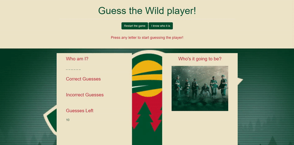

# Assignment-3-Hangman-Game

I. Hangman Game
------------
1. In the jumbotron section, the first thing on screen is "Guess the Wild Player!" which has no function. 
2. Underneath it, we have two buttons; the first button is the restart button which will reset the entire game and start the game up again and the second button is the guess button which will allow you to immediately guess the answer (which will let you guess even if you don't have enough guesses remaining).
3. Below the buttons is the message section, which will display messages depending on where the game stands, or other necessary notifications for the person playing the game.
4. On the left side of the column, you'll see there are 4 separate red headers and their content below. The first one will display the number of letters the current player's name contains. As you guess correctly, those _ will turn into the corresponding letters.
5. The other 3 sections are pretty self-explanatory; they will display the correct guesses, incorrect guesses, and the number of guesses left as the game progresses through.
6. On the right side of the column, the header and the picture will change to the corresponding player's header and his picture whenever the correct player is guessed. When the game rese                                                                          ts, it defaults back.

II. Thoughts
------------
1. My google foo has definitely improved from this project alone, I couldn't have done it without looking over so many threads on stackoverflow and other useful websites.
2. I think my coding cleanliness could definitely improve still. It definitely has improved from the last homework but it's only so much.
3. I so wanted to use the transparent background image and make the contents show up on top of it but I realize that majority of people will struggle to read the contents then; also I'll probably get a better grade if I don't use any opacity that involves background.

- mock

[1]: https://mcale017.github.io/Assignment-3-Hangman-Game/